## Sumário

- [Título e Descrição](#FirebaseAuthCPP)
- [Estrutura de Diretórios](#Estrutura_De_Diretórios)
- [Demonstração](#Demonstração)
- [Funcionalidades](#Funcionalidades)
- [Stack utilizada](#Stack_Utilizada)
- [Variáveis de Ambiente](#Variáveis_De_Ambiente)
- [Deploy](#Deploy)

# FirebaseAuthCPP

Este projeto implementa as principais funcionalidades do serviço de autenticação do Firebase, utilizando o provedor de email/senha, com foco em aplicações desenvolvidas em C++.

## Estrutura_De_Diretórios 

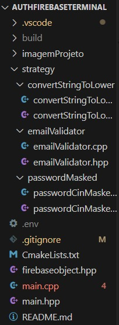

## Demonstração

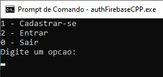

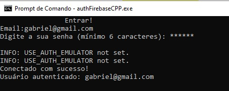
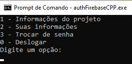


## Funcionalidades

- Cadastro de Usuário no firebase utilizando o provedor email/senha
- Login de usuários
- Trocar senha
- Logout

**Padrão de Projeto:** O projeto utiliza o padrão Strategy para implementar funcionalidades que podem ser reaproveitadas em várias partes do código, sem necessidade de reescrevê-las. Isso torna o código mais modular, organizado e fácil de manter.

## Stack_Utilizada

**Linguagem:** C++17

**Build:** CMake, utilizando o tipo de compilação **Release** com todas as bibliotecas linkadas **estaticamente**.

**Libs:** Firebase_cpp_sdk, Boost, Dotenv-cpp

O executável gerado é **estático**, ou seja, não depende de DLLs externas para rodar.

## Variáveis_de_Ambiente

Para rodar esse projeto, você vai precisar adicionar as seguintes variáveis de ambiente no seu .env

`FIREBASE_API_KEY`

`FIREBASE_PROJECT_ID`

`FIREBASE_APP_ID`

Segue um mini tutorial de como configurar cada uma delas:

1) Crie o seu projeto no firebase. Clicando a onde está circulado em vermelho.

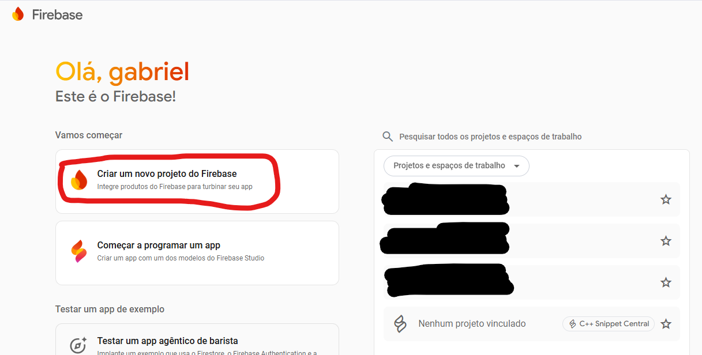

2) Digite um nome para o seu projeto e fiquei clicando no botão de continuar.

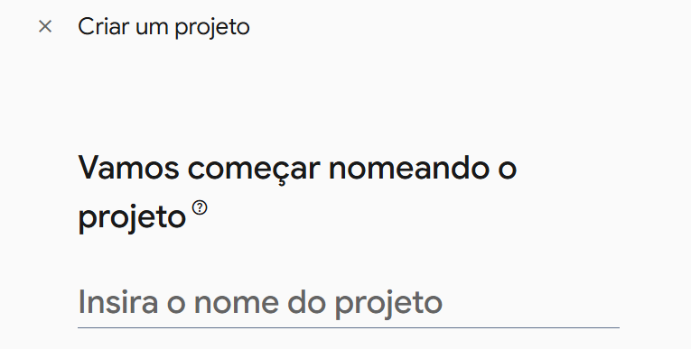

3)  Após finalizar a criação do projeto, você deve entrar no console do projeto, para acessar as informações, clique na engrenagem no canto superior esquerdo e depois na aba **Configuração do Projeto**.

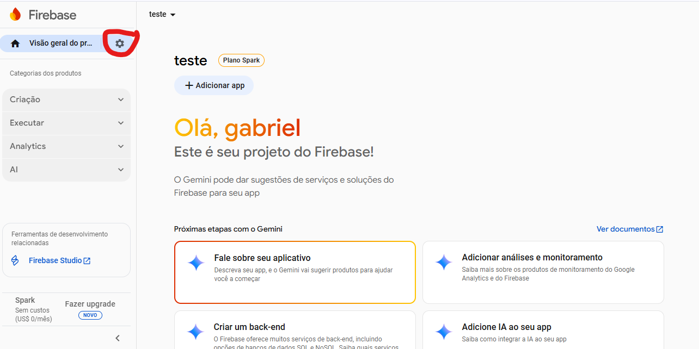


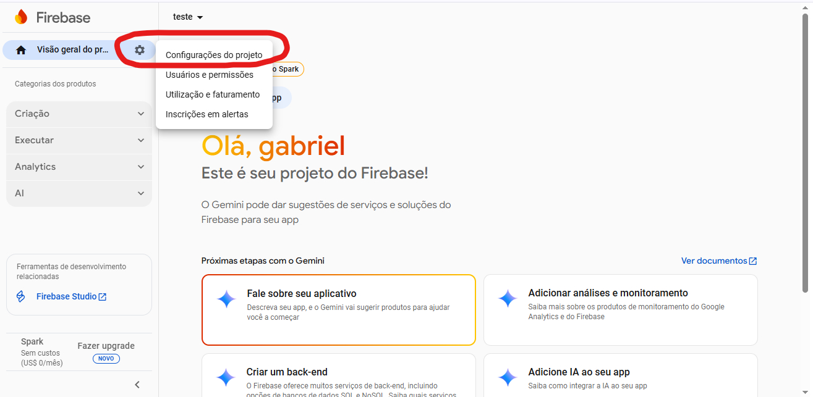

4) A sua primeira variavel de ambiente importante, **FIREBASE_PROJECT_ID** sempre será cria após a criação com sucesso do seu projeto.

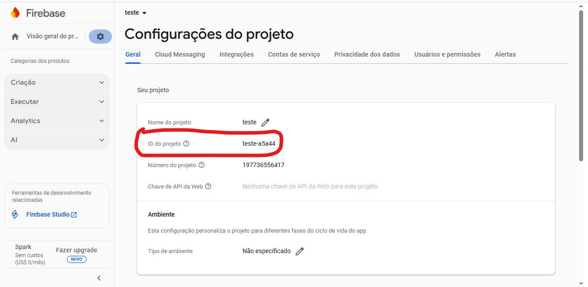

5) Para ativar FIREBASE_API_KEY, você escolher um dos serviços disponibilizados do firebase,
neste projeto foi utilizado o Authentication da aba criação. Clique no Criação, depois no Authentication e Vamos Começar. Agora é só escolher o provedor que deseje, neste projeto foi o Email/senha.

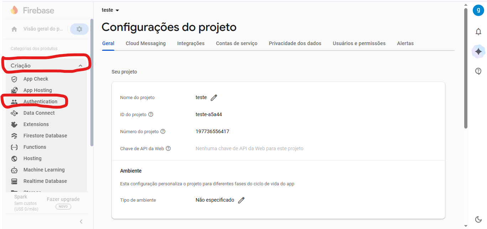


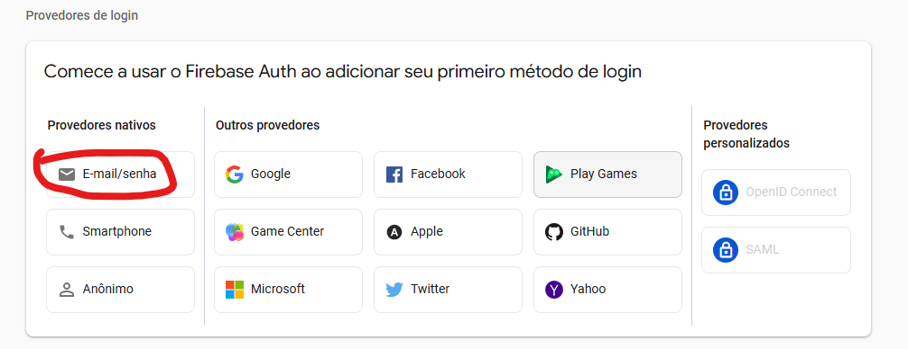

6) Assim estara disponivel a sua **FIREBASE_PROJECT_ID** nas Configuração do Projeto.

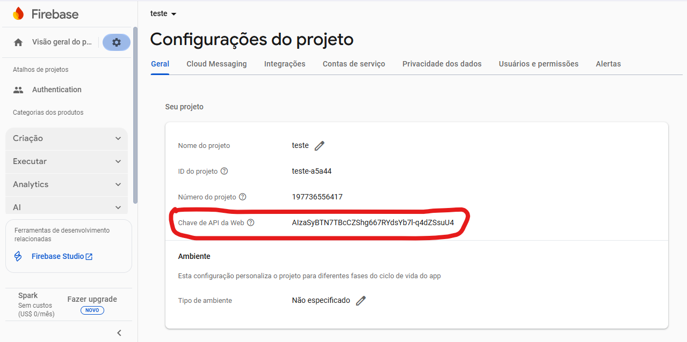

7) Para ativar a sua última variavel de ambiente, **FIREBASE_APP_ID**, você dizer em que plataforma o sua projeto irá ser registrado, para este projeto foi utilizado a versão web, só para inicializar a FIREBASE_APP_ID. Escolha entre NPM ou TAG e em **Continuar** no console.

**Obs:** Um projeto Firebase pode ter mais de um app, e cada app terá sua própria **FIREBASE_APP_ID**.

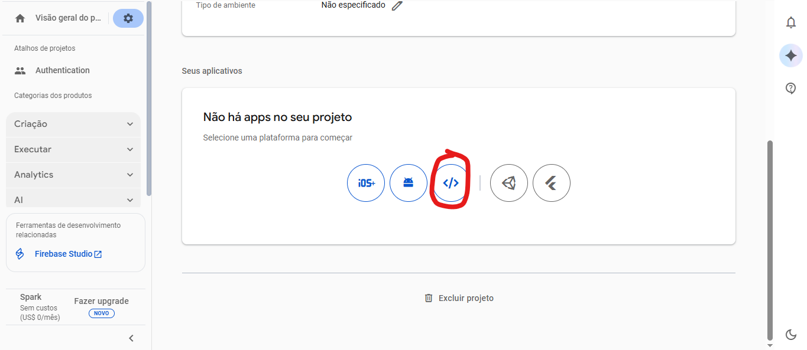

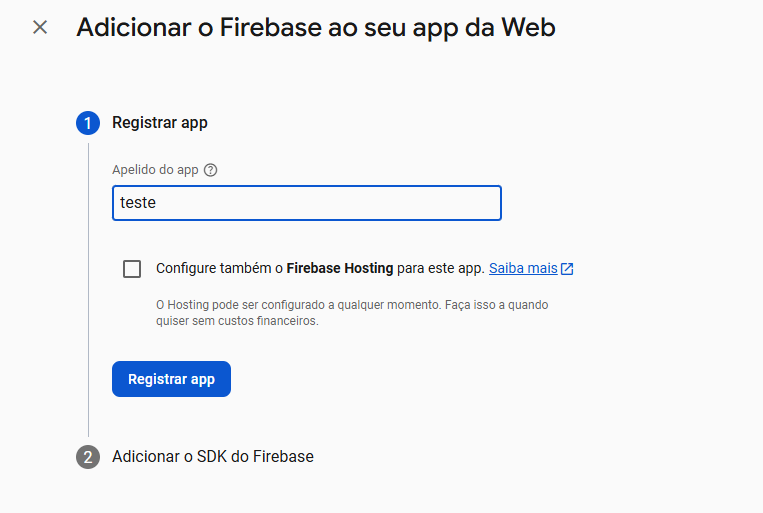

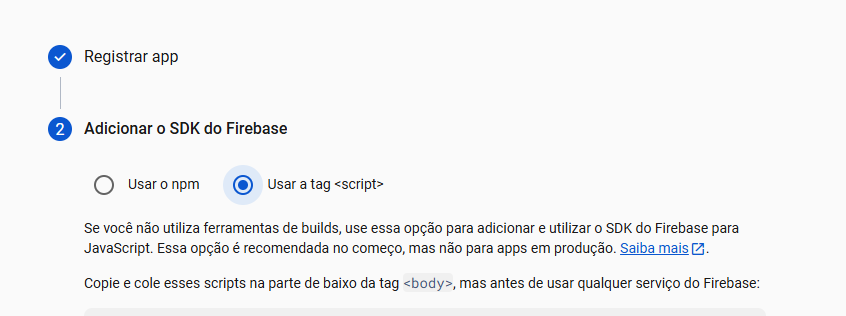

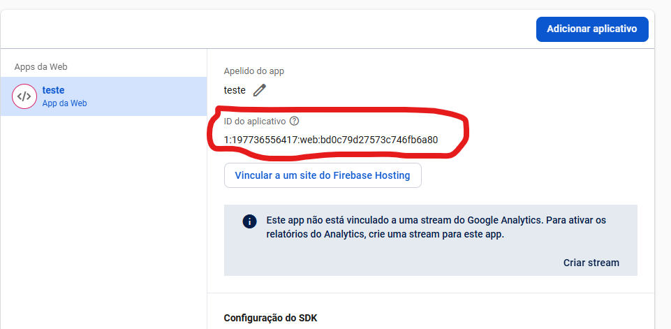

## Deploy

Para fazer o deploy deste projeto, primeiro exclua a pasta `build` e compile conforme descrito:

```
    git clone https://github.com/GabrielGPertile/authFirebaseCPP/tree/master
    mkdir build
    cd build
    cmake .. -G "Visual Studio 17 2022"
    cmake ..
    cmake --build . --config Release
    cd Release 
    authFirebaseCPP.exe
```

Para facilitar, foi adicionado a pasta ParaBaixar, que contém o projeto executável e o arquivo das variáveis de ambiente. O único requisto é que o seu computador tenha o sistema operacional windows e que tenha instalado o Visual C++ Redistributable 2015-2022. Se for baixando no Windows 7, pode ser que o `.env` venha com o nome `env`, para conserta isso, você deve entrar no terminal na mesma pasta que está o executal e o `.env` e renomea-lo com esse comando: 
    ren env .env

No demais é só alterar o contéudo do `.env` conforme está descrito na seção Variáveis_de_Ambiente.

**Obs:** O arquivo `.env` deve ficar na mesma pasta do `.exe` e deve ter o nome `.env`.