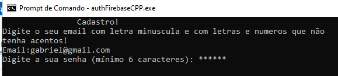

## Sumário

- [Título e Descrição](#FirebaseAuthCPP)
- [Estrutura de Diretórios ](#Estrutura_De_Diretórios)
- [Demonstração](#Demonstração)
- [Funcionalidades](#Funcionalidades)
- [Stack utilizada](#Stack_Utilizada)
- [Variáveis de Ambiente](#Variáveis_De_Ambiente)
- [Deploy](#Deploy)

# FirebaseAuthCPP

Este projeto implementa as principais funcionalidades do serviço de autenticação do Firebase, utilizando o provedor de email/senha, com foco em aplicações desenvolvidas em C++.

## Estrutura_De_Diretórios 


## Demonstração





## Funcionalidades

- Cadastro de Usuário no firebase utilizando o provedor email/senha
- Login de usuários
- Trocar senha
- Logon

**Padrão de Projeto:** O projeto utiliza o padrão Strategy para implementar funcionalidades que podem ser reaproveitadas em várias partes do código, sem necessidade de reescrevê-las. Isso torna o código mais modular, organizado e fácil de manter.## Stack utilizada

## Stack_Utilizada

**Linguagem:** C++17

**Build:** CMake, utilizando o tipo de compilação **Release** com todas as bibliotecas linkadas **estaticamente**

**Libs:** Firebase_cpp_sdk, Boost, Dotenv-cpp

O executável gerado é **estático**, ou seja, não depende de DLLs externas para rodar.

## Variáveis_de_Ambiente

Para rodar esse projeto, você vai precisar adicionar as seguintes variáveis de ambiente no seu .env

`FIREBASE_API_KEY`

`FIREBASE_PROJECT_ID`

`FIREBASE_APP_ID`


## Deploy

Para fazer o deploy desse projeto, deve-se primeiro excluir a pasta build e buildar conforme a descrição:

```
    git clone https://github.com/GabrielGPertile/authFirebaseCPP/tree/master
    cmake .. -G "Visual Studio 17 2022" -A x64 -DCMAKE_MSVC_RUNTIME_LIBRARY="MultiThreaded$<$<CONFIG:Debug>:Debug>"
    mkdir build
    cd build
    cmake ..
    cmake --build . --config Release
    cd Release 
    authFirebaseCPP.exe
```

Obs: O arquivo .env deve ficar na mesma pasta do .exe e deve ter o nome .env.